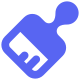
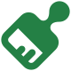
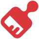
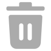
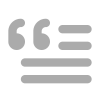
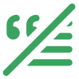
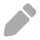
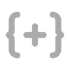
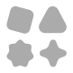
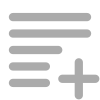

# Icon Source

Some icons used in this project are custom-made. However, before creating a new icon, please check [tabler.io/icons](https://tabler.io/icons) to see if a suitable one already exists.

## Icon list

### Component types

| Icon                                  | Component    |
|---------------------------------------|--------------|
|      | Button Link  |
|        | Container    |
|              | Button       |
|  | MediaGallery |
|              | Select       |
|        | Separator    |
|              | File         |
|    | TextDisplay  |

### Button colors

| Blue                            | Green                             | Grey                            | Red                           |
|---------------------------------|-----------------------------------|---------------------------------|-------------------------------|
|  |  |  |  |

### Actions

| Action                                      | Undo action                                             | Usage                                     |
|---------------------------------------------|---------------------------------------------------------|-------------------------------------------|
|                      | Not needed                                              | Color picker: Close; All "delete" actions |
|                      |                      | Container: Add color                      |
|                  |                  | Container: Spoiler                        |
|                      |                      | Button/Select: Set Emoji                  |
|                        |                        | Button/Select: Set Disabled               |
|                  |                  | Select: Set as default                    |
|  |  | Select: Change description/placeholder    |
|    | Not needed                                              | Button/Select: Change label               |
|                        | Not needed                                              | Select: Global settings                   |
|                  | Not needed                                              | Select: Minimum options                   |
|                  | Not needed                                              | Select: Maximum options                   |
|                | Not needed                                              | File component: Set/change file icon      |
|                      | Not needed                                              | Add component                             |
|    |    | Thumbnail: Add description                |
|          | Not needed                                              | Thumbnail: Upload image                   |
|                          | Not needed                                              | Thumbnail: Set image URL; Button: Set URL |

### Placeholder

If you don't have time to create an icon or want a placeholder one, you can use the **Icons.svg**:

